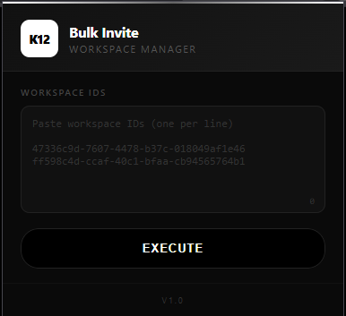

# ChatGPT K12 Bulk Invite

> Chrome extension to bulk invite users to multiple ChatGPT K12 workspaces at once.



## Features

- Bulk invite to multiple workspaces in one click
- Auto-detects and skips workspaces you're already in
- Real-time progress bar with percentage
- Live activity log with checkmark/X status per invite
- Mini status indicator with animated icon
- UUID validation - skips invalid IDs automatically
- Animated glow border on execute button
- Minimalist black & white dark theme

## Installation

1. Download or clone this repo
2. Open Chrome → `chrome://extensions/`
3. Enable **Developer mode** (top right)
4. Click **Load unpacked**
5. Select the `k12_extension` folder

## Usage

1. Log into [chatgpt.com](https://chatgpt.com)
2. Click the extension icon in toolbar
3. Paste workspace IDs (one per line)
4. Click **Execute**
5. Watch the progress
6. Refresh page to see new workspaces

## Workspace ID Format

```
47336c9d-7607-4478-b37c-018049af1e46
ff598c4d-ccaf-40c1-bfaa-cb94565764b1
1e595494-2426-4946-b688-58ba75604bcc
```

## Log Status

| Icon | Meaning |
|------|---------|
| ✓ | Invite sent successfully |
| ✗ | Invite failed |
| ~ | Processing |

## Notes

- You must be logged into chatgpt.com for the extension to work
- Extension only activates on chatgpt.com
- 1 second delay between requests to avoid rate limits
- Already-joined workspaces are automatically skipped
- Invalid UUIDs are skipped with error count

## License

MIT
